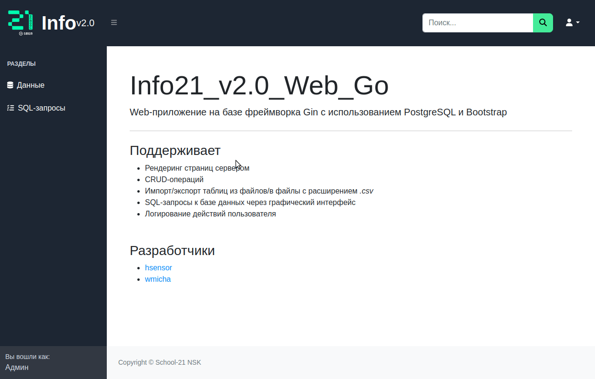

# Web Info (WIP)

<!-- markdownlint-disable -->
<div align="center">
  <p align="center">
    <a href="#about">About</a> •
    <a href="#features">Features</a> •
    <a href="#usage">Usage</a> •
    <a href="#authors">Authors</a>
  </p>
  
</div>
<!-- markdownlint-enable -->

## About

The implementation of an intuitively comprehensible graphical interface for interacting with a PostgreSQL database using Gin and Gorm.

## Features

- Adherence to clean architecture principles
- Implementation of Server-Side Rendering (SSR)
- Separate сontainerization with isolated nginx access is implemented
- CRUD (Create, Read, Update, Delete) operations
- Importing and exporting tables to/from CSV files
- Executing SQL queries (stored and custom) on the database through a graphical interface
- User action logging
- User-friendly interface design with an intuitive layout

## Usage

To use this project, you can utilize the following [task](https://taskfile.dev/installation/) commands:

Build the application:

```shell
task build
```

Migrate the postgres database:

```shell
task migrate
```

Deploy database, web application, and nginx in separate [docker](https://docs.docker.com/engine/install/) containers:

```shell
docker-compose up
```
## Authors

- [dmnAlex](https://github.com/dmnAlex)
- [dsnikitin](https://github.com/dsnikitin)
